<div align="center">

# Heads Up

**A warning before a delivery goes wrong, not a report after it already has.**

Late delivery risk prediction and shipment prioritization for the DataCo Smart Supply Chain data.

[](https://huggingface.co/spaces/nayanasisil2700/heads-up)
[](DECISION_LOG.md)
[](#the-team-and-the-course)


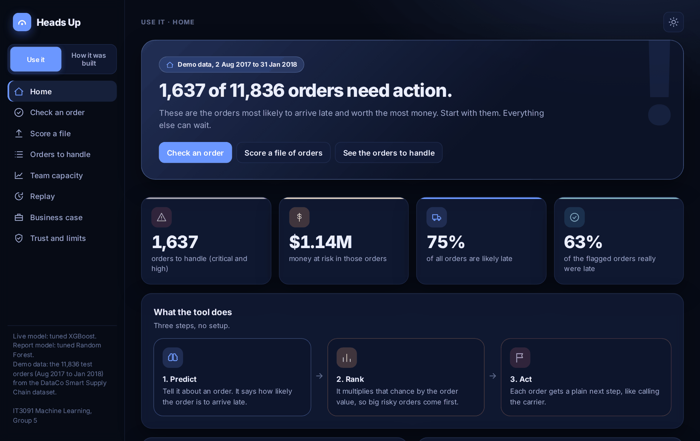

</div>

## Heads Up in 30 seconds

A logistics company ships hundreds of orders a day. Operations only finds out an order is late after it is already late. Heads Up looks at an order **at the moment it is placed**, says how likely it is to arrive late, and ranks the risky orders by how much money is at stake. The team gets a short list to act on, not a score to decode.

| What you get | Result on 11,836 orders the model never saw |
|---|---|
| Late orders caught | **86%** with the live XGBoost model, **88%** with the Random Forest used in the report |
| Money reached | The top 10% of the queue holds **36.2%** of all late revenue. Random picking reaches 10.8% |
| Size of the live model | **0.88 MB**, so it runs inside the web page with no server |

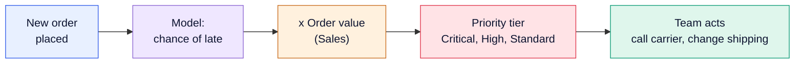

Two lenses, one model. The **primary lens** is late delivery risk (binary classification of `Late_delivery_risk`). The **secondary lens** is shipment prioritization: chance of late times order value gives a ranked action queue.

## Read this repo in 5 minutes

1. **Open the [live app](https://huggingface.co/spaces/nayanasisil2700/heads-up).** The "Use it" side is the tool. The "How it was built" side walks through all ten project stages with the real numbers.
2. **Skim [`DECISION_LOG.md`](DECISION_LOG.md).** Every choice we made, with the reason and what we rejected.
3. **Open the notebooks in order**, `notebooks/01` to `06`, to see the work behind each stage.

## What it looks like

<table>
<tr>
<td width="50%">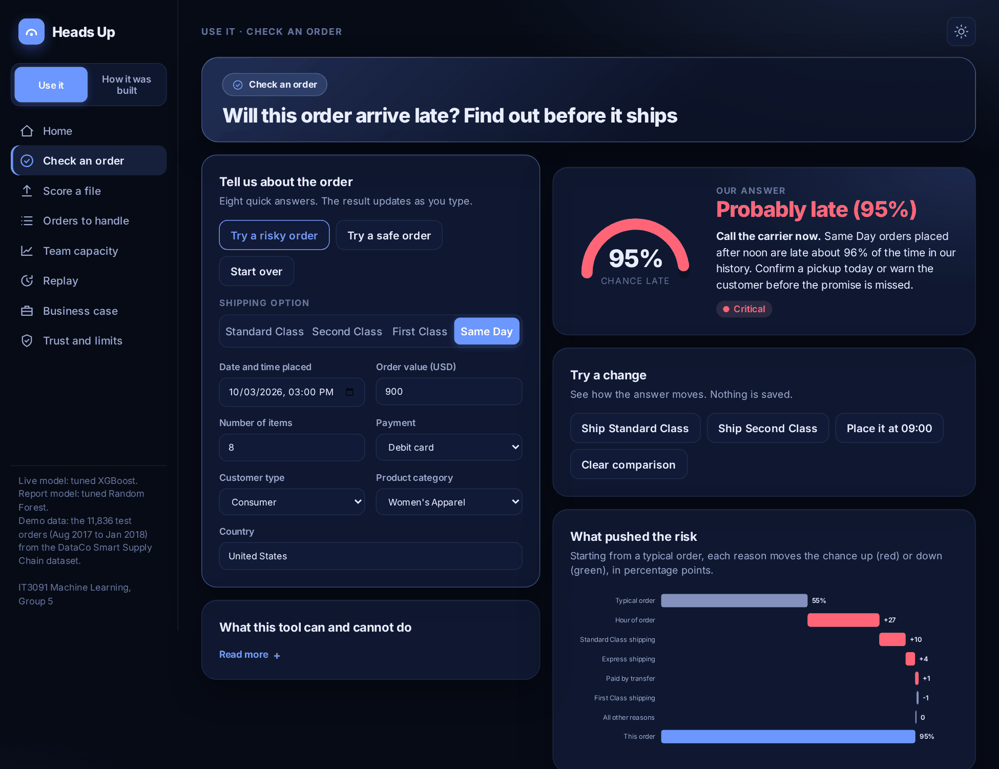<br><sub><b>Check an order.</b> Eight answers in, one verdict and a next step out. The chart shows what pushed the risk up or down.</sub></td>
<td width="50%">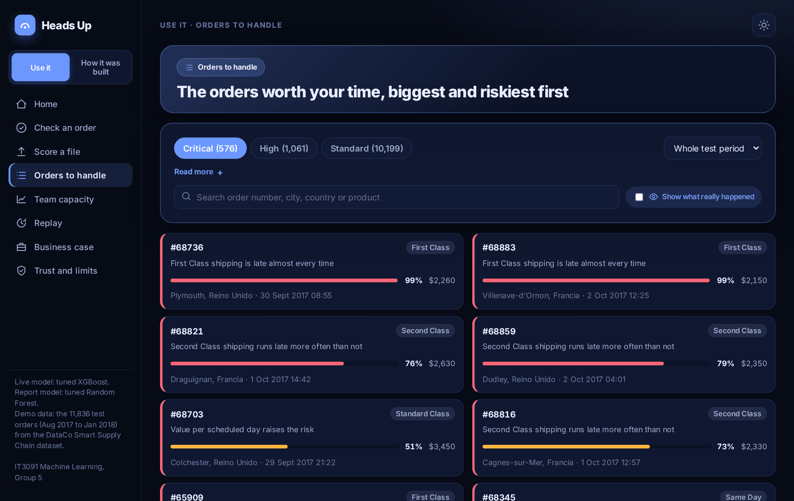<br><sub><b>Orders to handle.</b> Critical, High and Standard orders in one list, biggest and riskiest first.</sub></td>
</tr>
<tr>
<td>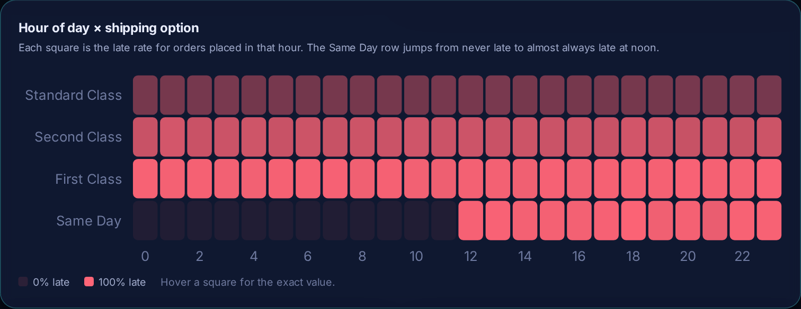<br><sub><b>The noon cliff.</b> Same Day orders placed before noon are never late. From noon they are late about 96% of the time.</sub></td>
<td>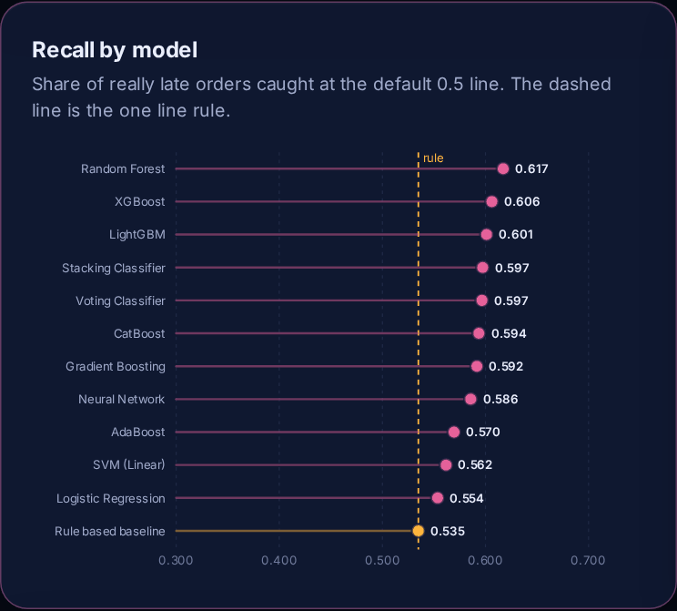<br><sub><b>Twelve models.</b> Compared against a one line rule. The best models sit close together.</sub></td>
</tr>
</table>

<details>
<summary><b>More screens</b> (final evaluation, threshold explorer, prioritization, phone view)</summary>
<br>

| Final evaluation | Prioritization |
|---|---|
| 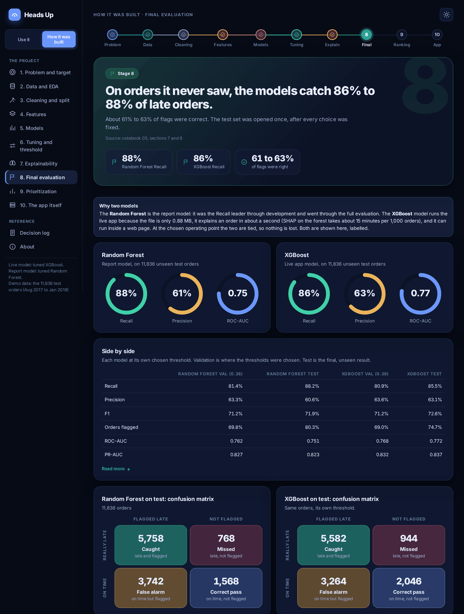 | 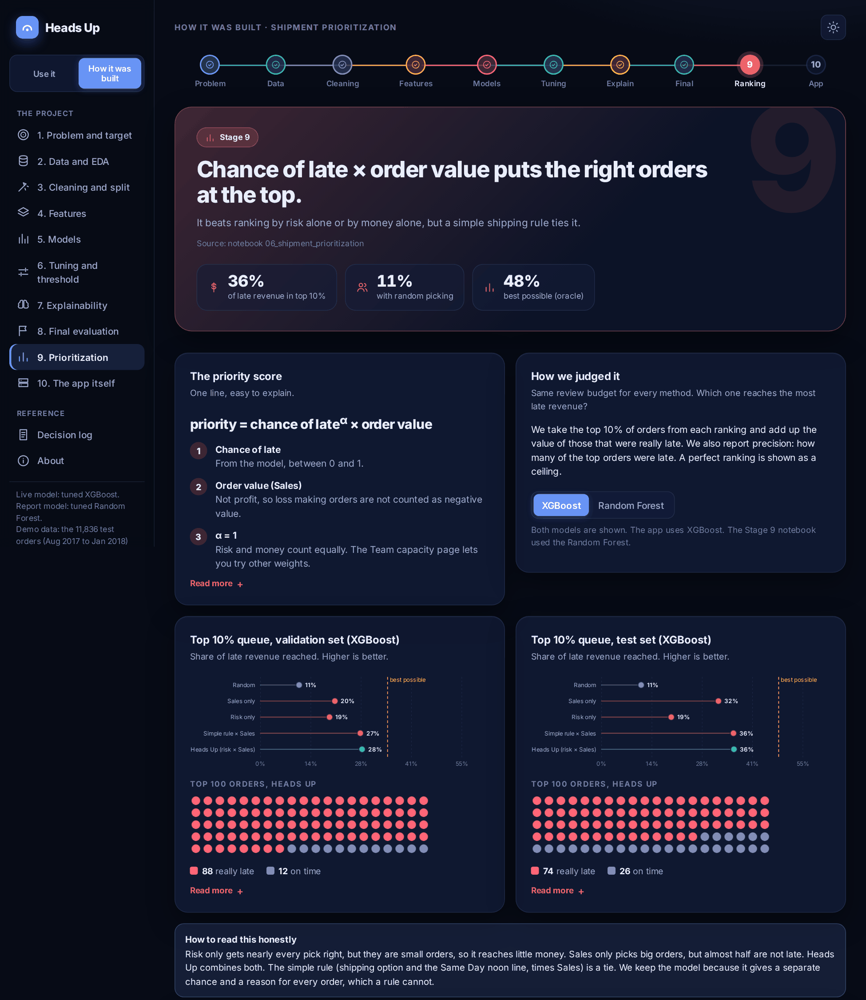 |

| Threshold explorer | On a phone |
|---|---|
| 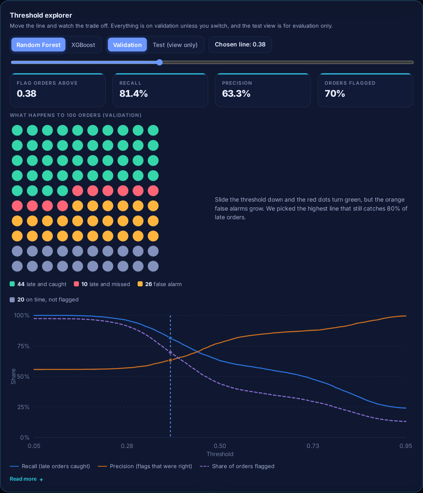 | 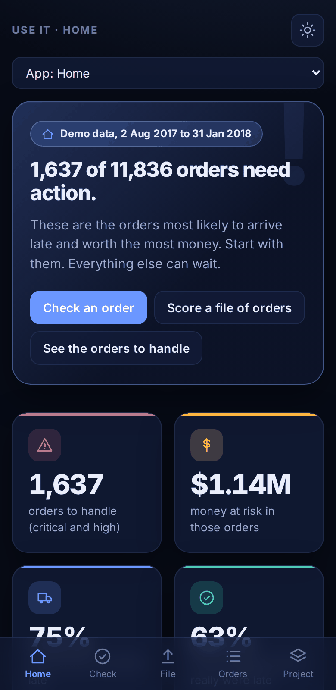 |

</details>

## Results

Both models are reported. The **Random Forest** is the report model: it led on Recall through development and went through the full evaluation. The **XGBoost** model runs the live app because the file is small, it explains an order in about a second, and it runs in a web page. At the chosen operating point the two are tied.

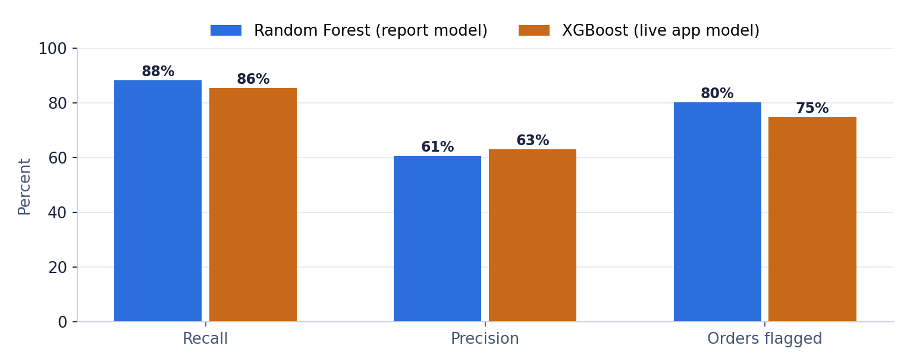

| On the test set (11,836 orders) | Random Forest | XGBoost |
|---|---|---|
| Flag line (set on validation) | 0.38 | 0.39 |
| Recall, late orders caught | 88.2% | 85.5% |
| Precision, flags that were right | 60.6% | 63.1% |
| F1 | 71.9% | 72.6% |
| Orders flagged | 80.3% | 74.7% |
| ROC-AUC | 0.752 | 0.772 |
| PR-AUC | 0.823 | 0.837 |

**Does the ranking help?** Reviewing only the top 10% of orders, each method reaches this share of the late revenue:

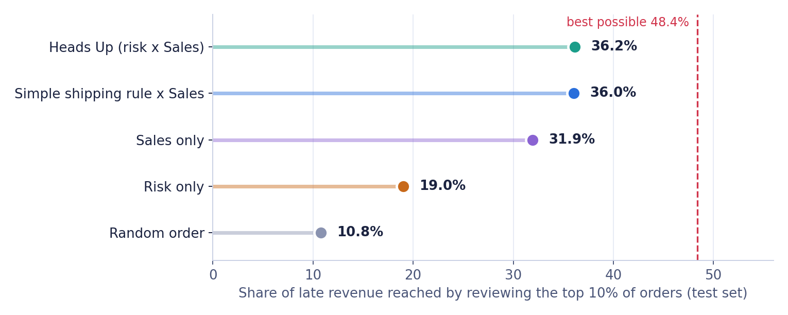

The model beats risk alone and sales alone. A simple two line shipping rule ties it. We keep the model because it also gives a chance and a reason for every order, which a rule cannot.

**Where the flag line comes from.** We pick the highest threshold that still catches 80% of late orders on validation. The cost based threshold (a missed late order costs 3, a false alarm costs 1) lands at 0.11 and flags about 97% of orders, which is no use to an operations team.

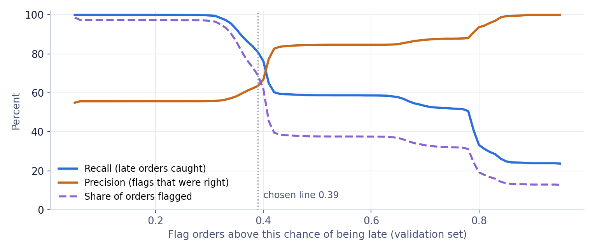

## What we found

1. **Shipping option is the main signal.** First Class is late 95% of the time and Standard Class 38%, a 57 point gap. Calendar effects are flat.
2. **The noon cliff.** Same Day orders placed before noon are never late. From noon they are late about 96% of the time. This looks like a rule built into the dataset, so a real carrier may behave differently.
3. **A simple rule is a tough opponent.** The one line baseline reaches Recall 0.53 and ROC-AUC 0.73. The best of twelve models reaches 0.765. Tuning moved ROC-AUC by less than one point.
4. **Leakage was handled first.** Fields only known after delivery, such as delivery status and real shipping days, were excluded before any modelling. Lookup tables for country, region and category come from the training set only.
5. **Order values fell over time.** Average order value was $591 in train, $612 in validation and $401 in test, so fewer test orders reach the Critical tier. The tier cut points need refreshing on recent data.

## How the project is built

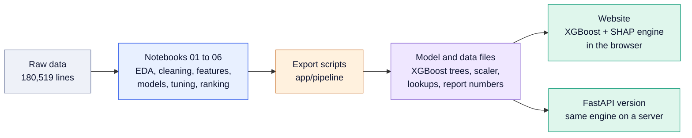

| Stage | What happens | Where |
|---|---|---|
| 1. Problem and target | Predict late delivery at order time, judge by Recall | README, decision log |
| 2. Data and EDA | 180,519 lines, 53 columns, 54.82% late. Leakage check on every field | `notebooks/01_eda.ipynb` |
| 3. Cleaning and split | Lines become 65,752 orders. Time based split: train 46,026 (to Mar 2017), validation 7,890 (to Aug 2017), test 11,836 (to Jan 2018) | `notebooks/02_preprocessing.ipynb` |
| 4. Features | 28 inputs built from simple rules | `notebooks/03_feature_engineering.ipynb` |
| 5. Models | Rule baseline plus twelve models compared | `notebooks/04_model_development.ipynb` |
| 6 and 7. Tuning and threshold | Optuna tuning, flag line from a Recall target of 0.80 | `notebooks/05_hyperparameter_tuning_and_evaluation.ipynb` |
| 8. Explainability and final test | SHAP, then one look at the test set | same notebook, sections 6 to 8 |
| 9. Prioritization | Chance of late times Sales, three action tiers | `notebooks/06_shipment_prioritization .ipynb` |
| 10. The app | Decision support site and API | `app/` |

## Run it

**Just look at it:** open the [live app](https://huggingface.co/spaces/nayanasisil2700/heads-up). Nothing to install.

**Run the web app on your machine** (Node 20 or newer):

```bash
git clone https://github.com/nayana-sisil/Heads-Up_IT3091.git
cd Heads-Up_IT3091/app/backend && pip install -r requirements.txt
uvicorn main:app --port 7860          # terminal 1: the API

cd ../frontend && npm install && npm run dev   # terminal 2: opens on http://localhost:5173
```

**Build the static site** (this is what the live app runs, no server needed):

```bash
python app/pipeline/make_static_data.py
cd app/frontend && npm run build:static     # output in dist-static
npm run check:features                      # rebuilds features for all 11,836 test orders
```

**Rerun the notebooks** (Python 3.11):

```bash
python -m venv .venv && source .venv/bin/activate     # Windows: .venv\Scripts\activate
pip install -r requirements.txt
jupyter lab                                           # open notebooks/01 to 06 in order
```

The raw DataCo files are in `data/raw data/`. Each notebook saves its outputs to `data/processed/` and `models/`.

**Refresh the numbers the site shows** after changing a notebook or model:

```bash
python app/pipeline/export_app_data.py
python app/pipeline/export_lookups.py
python app/pipeline/export_report_data.py
```

## Checks we ran

| Check | Result |
|---|---|
| API tests (`cd app/backend && python -m pytest tests`) | 16 pass |
| Browser against Python (`npm run check:features`) | All 11,836 test orders rebuilt from raw fields give the same tier. Largest probability difference 0.00005 |
| Report numbers against the notebooks | Asserted when the data is exported: test result, threshold, the 12 model scores, EDA figures |
| README numbers (`python docs/check_readme_numbers.py`) | Every figure above is compared with the report file the site reads |

## Honest limits

- It scores **one order at the moment it is placed**. It does not forecast next week's volume.
- The Same Day noon pattern looks like a rule inside this dataset. Real operations may show a weaker effect.
- A simple shipping rule ties the model on revenue reached. The model adds a separate chance and a reason for every order.
- Average order value dropped in the test period, so tier cut points should be refreshed on recent data.
- Countries and products never seen in training fall back to training averages, and the app says so.
- The live demo replays the public DataCo test orders. Do not put private data into a public Space.

## Repository map

```
Heads-Up_IT3091/
├── README.md                  this file
├── DECISION_LOG.md            every decision with reason and alternatives
├── requirements.txt           Python packages for the notebooks
├── notebooks/                 01 EDA to 06 prioritization
├── data/
│   ├── raw data/              DataCo CSV and column descriptions
│   └── processed/             cleaned data, splits, metrics, chosen threshold
├── models/                    trained models and SHAP values
├── reports/                   figures and the initial submission
├── docs/                      data dictionary, README images and chart script
├── experiments/               one sandbox folder per team member
└── app/
    ├── frontend/              React and TypeScript site, in browser XGBoost and SHAP
    ├── backend/               FastAPI version of the same engine, with tests
    ├── pipeline/              scripts that export model and report data
    ├── deploy_static.py       publishes the static site
    └── Dockerfile             single container build
```

## The team and the course

| Member | Student ID | Role |
|---|---|---|
| Wijesinghe D H R | IT24102372 | Business problem framing, EDA, final recommendation |
| Sanjana K D A | IT24102364 | Preprocessing and feature engineering |
| Wijekoon W M N S B | IT24101446 | Baseline strategy and model development |
| Pahalawaththage P W I H | IT24101303 | Evaluation, hyperparameter optimization, SHAP |

| Field | Value |
|---|---|
| Track | Guided Data Track |
| Domain | Logistics and Supply Chain |
| Dataset | DataCo Smart Supply Chain |
| Institution | Sri Lanka Institute of Information Technology |
| Course | Machine Learning (IT3091), 2026, Year 3, Semester 1 |
| Group | 2026 DS 05, batch Y3.S1.WE.DS.0102 |

## How we work

Every non trivial choice goes into [`DECISION_LOG.md`](DECISION_LOG.md) with the context, the options and the reason. Work happens on branches with small commits and a pull request before merging. Risky ideas start in `experiments/<name>/` and move into the shared notebooks only once they work.

## License and credits

Academic use only. Sri Lanka Institute of Information Technology, IT3091, 2026. Data: DataCo Smart Supply Chain dataset. The web app was built with help from Claude (Anthropic).
